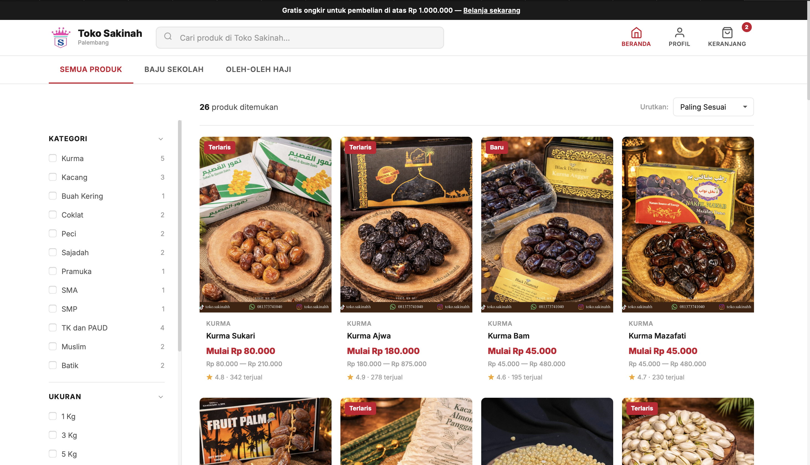

# Toko Sakinah — Website E-Commerce

Website e-commerce untuk **Toko Sakinah**, toko yang menyediakan baju sekolah dan oleh-oleh haji di Palembang, Sumatera Selatan.

## Preview



## Fitur Utama

- **Katalog Produk** — 26 produk dalam 2 kategori (Baju Sekolah & Oleh-Oleh Haji) dengan variasi ukuran, warna, dan gender
- **Filter & Sorting** — Filter berdasarkan subkategori, ukuran, rentang harga, dan rating. Sorting berdasarkan harga, rating, terlaris, dan terbaru
- **Pencarian Real-time** — Cari produk berdasarkan nama atau subkategori secara instan
- **Stok per Ukuran** — Setiap ukuran memiliki stok terpisah yang ditampilkan secara dinamis
- **Harga Dinamis** — Harga otomatis berubah sesuai ukuran yang dipilih
- **Image Slideshow** — Navigasi foto produk untuk produk dengan gambar lebih dari satu
- **Keranjang Belanja** — Simpan produk yang dipilih dan kelola kuantitas
- **Checkout via WhatsApp** — Kirim pesanan langsung ke WhatsApp toko dengan format pesan otomatis
- **Responsif** — Desain adaptif untuk desktop, tablet, dan mobile
- **Profil Toko** — Informasi toko, jam operasional, cara pemesanan, dan metode pembayaran

## Teknologi

| Teknologi | Keterangan |
|-----------|------------|
| HTML5 | Struktur halaman dan semantic markup |
| CSS3 | Styling dengan CSS Variables, Grid, Flexbox, dan Media Queries |
| JavaScript (Vanilla) | Logika aplikasi, DOM manipulation, dan Fetch API |
| JSON | Penyimpanan data produk (`data/products.json`) |
| Google Fonts | Font Inter untuk tipografi modern |
| LocalStorage | Menyimpan data keranjang belanja di browser |

## Struktur Proyek

```
toko-sakinah/
├── index.html              # Halaman utama (HTML + inline CSS)
├── js/
│   └── app.js              # Logika aplikasi utama
├── data/
│   ├── products.json       # Data produk (source of truth)
│   ├── logo_toko.png       # Logo toko
│   ├── oleh-oleh-haji/     # Gambar produk oleh-oleh haji
│   └── baju-sekolah/       # Gambar produk baju sekolah
├── css/
│   └── style.css           # Stylesheet tambahan 
└── README.md               # File ini
```

## Cara Menjalankan

1. **Clone repository**
   ```bash
   git clone https://github.com/username/toko-sakinah.git
   cd toko-sakinah
   ```

2. **Jalankan dengan Live Server**
   - Buka di VS Code
   - Install extension **Live Server**
   - Klik kanan `index.html` → **Open with Live Server**

   > File harus dibuka melalui server (localhost) agar `fetch()` untuk memuat `products.json` berfungsi. Buka langsung via `file://` tidak akan berfungsi karena kebijakan CORS pada browser.

3. **Atau gunakan HTTP server**
   ```bash
   # Dengan Python
   python3 -m http.server 8000

   # Dengan Node.js
   npx serve .
   ```

4. Buka `http://localhost:8000` di browser

## Mengelola Produk

Semua data produk disimpan di `data/products.json`. Untuk menambah, mengubah, atau menghapus produk, cukup edit file JSON tersebut.

### Struktur Data Produk

```json
{
  "id": 1,
  "name": "Nama Produk",
  "category": "oleh-oleh-haji",
  "subcategory": "Kurma",
  "price": 80000,
  "rating": 4.8,
  "sold": 342,
  "sizes": ["1 Kg", "3 Kg"],
  "priceBySize": { "1 Kg": 80000, "3 Kg": 210000 },
  "stockBySize": { "1 Kg": 50, "3 Kg": 35 },
  "images": ["data/oleh-oleh-haji/foto.jpeg"],
  "description": "Deskripsi produk...",
  "badge": "Terlaris"
}
```

| Field | Tipe | Keterangan |
|-------|------|------------|
| `id` | number | ID unik produk |
| `name` | string | Nama produk |
| `category` | string | Kategori utama (`baju-sekolah` / `oleh-oleh-haji`) |
| `subcategory` | string | Subkategori (Kurma, Kacang, Pramuka, dll) |
| `price` | number | Harga default (harga terendah) |
| `rating` | number | Rating produk (1.0 - 5.0) |
| `sold` | number | Jumlah terjual |
| `sizes` | array | Daftar ukuran/varian tersedia |
| `priceBySize` | object | Harga per ukuran |
| `stockBySize` | object | Stok per ukuran |
| `genders` | array | Pilihan gender (opsional: `["Cowo", "Cewe"]`) |
| `colors` | array | Pilihan warna (opsional) |
| `images` | array | Path gambar produk |
| `description` | string | Deskripsi produk |
| `badge` | string | Badge di card (opsional: `"Terlaris"` / `"Baru"`) |

## Informasi Toko

| | |
|---|---|
| **Nama** | Toko Sakinah |
| **Alamat** | Lorong Basah, 16 Ilir, Palembang |
| **WhatsApp** | 081373741040 |
| **Instagram** | @toko.sakinah |
| **Email** | konpeksisakinah@gmail.com |

## Lisensi

Proyek ini dibuat untuk keperluan tugas Mini Project mata kuliah Pemrograman Web.

---
